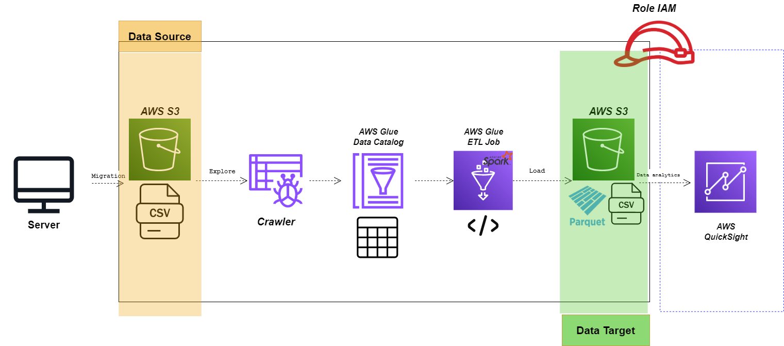

# ETL AWS Women STEM 🚀

Este repositorio forma parte de la presentación de la charla técnica *"Transformando datos y realidades: tu primera experiencia con AWS Glue"*, impartida el 8 de mayo en **Amazon HQ, CDMX**.
Con el objetivo de inspirar a mujeres y personas que están comenzando en el mundo del análisis de datos, se expone el proceso de construcción de un pipeline ETL utilizando AWS Glue, cuyos resultados se visualizan posteriormente en Amazon QuickSight.
El desarrollo se centra en el procesamiento de una base de datos con indicadores clave para comprender la brecha de género y la situación de las mujeres en el ámbito STEM, desde una perspectiva social y humanística.

## 📖 Descripción

Este proyecto de ingeniería de datos permite automatizar procesos de extracción, transformación e imputación de datos utilizando AWS Glue y Amazon QuickSight, enfocado específicamente en datos sobre mujeres estudiantes y profesionistas en áreas STEM en América Latina.

## 🛠️ Tecnología Utilizada

* **AWS Glue**: para la creación y ejecución del ETL.
* **Amazon QuickSight**: para visualización interactiva de resultados.
* **AWS S3**: almacenamiento de datos en la nube.
* **Python**: lenguaje de programación para scripts ETL.
* **Pandas y scikit-learn**: bibliotecas utilizadas para manejo e imputación de datos.

## 🗂️ Estructura del Proyecto

```
. ├── reports/              # Presentación de desarrollo, resultados y gráficos exportados
  ├── glue_job_script.py    # Script principal de Glue para ETL e imputación de datos.
  ├── manifest.json         # Archivo para especificar ubicación y formato de archivos en S3.
  └── requirements.txt      # Dependencias necesarias para ejecución de librerias (opcional).
```

## 🧱 Arquitectura



## 🚩 Requisitos Previos

* Cuenta activa de AWS.
* Acceso configurado a AWS Glue y Amazon QuickSight.
* Bucket S3 previamente creado.

## 🔧 Cómo usar este repositorio

### 1️⃣ Crea un bucket de origen y destino y carga de archivos en Amazon S3


### 2️⃣ Configuración del Script en AWS Glue

* Accede a AWS Glue 
* Crea un crawler y guerda tus resultados en el data calog
* Crea un nuevo Job en Glue:

  * Tipo: Spark con Python 3
  * Rol IAM: Elige o crea uno con permisos adecuados (S3, Glue)
* Copia el código del archivo `glue_job_script.py` en el editor del Job.
* Ajusta rutas de S3 si es necesario.

### 3️⃣ Ejecutar el Job

* Guarda y ejecuta tu Job.
* Verifica en CloudWatch o la pestaña "Runs" el estado del proceso.

### 4️⃣ Visualización en QuickSight

* Usa el archivo `manifest.json` para configurar conjuntos de datos en Amazon QuickSight.
* Conecta QuickSight al bucket S3 correspondiente.
* Crea visualizaciones para analizar resultados.

## 📝 Ejemplo del Archivo Manifest

```json
{
  "fileLocations": [
    {"URIPrefixes": ["s3://target-woman-stem-latam/estudiantes_mice/"]},
    {"URIPrefixes": ["s3://target-woman-stem-latam/personal_mice/"]}
  ],
  "globalUploadSettings": {
    "format": "CSV"
  }
}
```

## 📌 Dependencias Python (opcional)

Si necesitas ejecutar o probar localmente:

```bash
pip install -r requirements.txt
```

## 📞 Soporte y contribuciones

Si tienes preguntas o sugerencias, ¡no dudes en abrir un issue o enviar un pull request!

---

¡Gracias por utilizar este repositorio! 🌟
